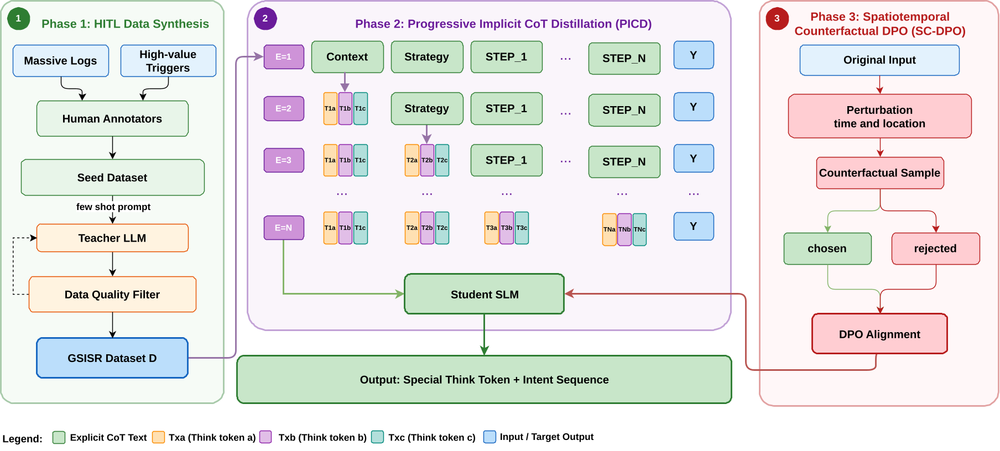

# GPlan: Generative Spatiotemporal Intent Sequence Recommendation via Implicit Reasoning in Amap

<div align="center">

AMAP, Alibaba Group

</div>

## 📋 Overview

Progressive Implicit CoT distillation training framework of GPlan. Uses **curriculum learning** to compress structured CoT texts into special think tokens epoch by epoch, distilling implicit reasoning capabilities.

<div align="center">

</div>

## 📊GSISR Dataset

The GSISR dataset is collected from Amap and provided in `data_process/dataset/`. All data have been **anonymized** to protect privacy — original feature names, POI identifiers, and user identifiers have been replaced with generic placeholders.

| File | Description | Num     |
|:-----|:------------|:--------|
| `data_process/dataset/train.csv` | Training set | 100,000 |
| `data_process/dataset/test.csv` | Test set | 1,000   |

### User Profiles and Behavior History

Each user is described by 14 anonymized profile features. All categorical values have been mapped to numerical IDs.

| Field                | Description                                                                                                                        |
|:---------------------|:-----------------------------------------------------------------------------------------------------------------------------------|
| User ID              | A unique numerical identifier for each user.                                                                                       |
| Profile Feature 1–14 | Anonymized user profile attributes.                                                                                                |
| Short-term Behavior Seq | Anonymized short-term behavior sequence. POI names and behavior types (e.g., click) are replaced with numerical IDs (`p_`, `act_`). |
| Long-term Behavior | Anonymized long-term behavior feature. Original values are replaced with numerical IDs.                                            |

### Context Information

| Field | Description                                                            |
|:---|:-----------------------------------------------------------------------|
| Current Time | Time of the request.                                                   |
| Weekend Flag | Whether the current day is a weekend (0/1).                            |
| Holiday Flag | Whether the current day is a holiday (0/1).                            |
| Current City & District | The city and district where the user is located.                       |
| Current POI Name | The name of the user's current Point of Interest (mapped to ID, `p_`). |
| Current POI Category | The tag of the current POI.                                            |

### Trigger Events

Each request includes 7 trigger event features that capture the user's immediate intent signals.

| Field | Description |
|:---|:---|
| Trigger 1–7 | Anonymized event trigger features. Original event types and descriptions are replaced with numerical IDs or kept as timestamps. |


### Labels

Each label is an **intent sequence** — a JSON array of tool-calling intents representing the recommendation. Each intent includes a tool name and associated parameters selected from a predefined intent library:

```json
[
  {"工具名称": "tool_5", "起始位置": "当前位置", "空间范围": "附近", "tag": "美食"},
  {"工具名称": "tool_2", "起始位置": "当前位置", "终点位置": "家"},
  ...
]
```

The intent library includes 10 tool types covering scenarios such as ride-hailing, navigation, transit, POI recommendation, order reminders, weather queries, etc.

> **Note:** The CoT (Chain-of-Thought) reasoning text used during training is **not included** in the public dataset release. Only the final intent sequences are provided as labels.

### Preparing CoT Text for Training

The training pipeline relies on the `raw_labels` column in the CSV, which must contain **both** the CoT reasoning text and the intent sequence JSON. Since the public dataset only provides the final intent sequences, you need to generate the CoT text yourself before training.

**Step 1: Generate CoT text using a large language model**

Use a capable LLM (e.g., GPT, Qwen) to generate structured CoT reasoning for each sample. The CoT must follow this XML-tagged format:

```
<THOUGHT>
<CONTEXT>Briefly analyze the current context and the user's potential needs</CONTEXT>
<STRATEGY>Based on the context analysis, devise the core strategy for the plan</STRATEGY>
<STEP_1>Focus on analyzing the primary and most crucial intent</STEP_1>
...
<STEP_n>Explain why the n-th intent is recommended</STEP_n>
</THOUGHT>
```

> The number of `<STEP_n>` tags **must equal** the number of intents in the JSON array.

**Step 2: Combine CoT and intent JSON into `raw_labels`**

Concatenate the CoT text and the intent JSON array into a single string, and write it to the `raw_labels` column of your CSV:

```
<THOUGHT><CONTEXT>...</CONTEXT><STRATEGY>...</STRATEGY><STEP_1>...</STEP_1><STEP_2>...</STEP_2><STEP_3>...</STEP_3></THOUGHT>[{"工具名称":"tool_5","起始位置":"当前位置","空间范围":"附近","tag":"美食"},{"工具名称":"tool_2","起始位置":"当前位置","终点位置":"家"},{"工具名称":"tool_7","tag":"景点"}]
```

The training collator (`ProgressiveCotDistillCollater`) will automatically parse this field, extract the CoT and JSON parts, and apply progressive distillation during training.

## 🚀 Quick Start

### Training

```bash
pip install -r requirements.txt
bash finetune.sh
```

### Testing

```bash
bash test.sh
```

## 📁 Project Structure

```
├── finetune.py                         # Training script (WeightedLossTrainer + SyncEpochCallback)
├── finetune.sh                         # Training launch script
├── test.py                             # Test script (Accuracy, Edit Similarity, NDCG@3)
├── test.sh                             # Test launch script
├── data_process/
│   ├── dataset/
│   │   ├── train.csv                   # Training dataset (anonymized)
│   │   └── test.csv                    # Test dataset (anonymized)
│   ├── collate_fns.py                  # Data collator (progressive distillation)
│   └── data_loader.py                  # CSV data loading
├── utils.py                            # Utility functions and argument definitions
├── add_tokens/extended_cot_vocabs.json  # CoT special token vocabulary
├── config/ds_z3_bf16.json              # DeepSpeed ZeRO-3 configuration
└── requirements.txt
```
